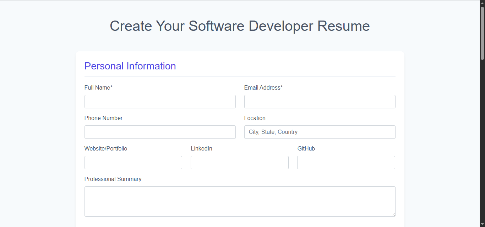

# 📄 Digital Resume Builder - Laravel


A no-login-required resume builder that generates professional PDF resumes from SQL database.





## ✨ Key Features

- 🚀 **Instant resume creation** (no authentication)
- 📑 **5 professional templates** with PDF download
- 🛢️ **SQL database** (MySQL/MariaDB/PostgreSQL)
- 📱 **Fully responsive** design
- ➕ **Dynamic sections** (add unlimited entries)

## 🛠️ Tech Stack

- **Backend**: Laravel 10
- **Database**: MySQL
- **PDF Generation**: DomPDF
- **Frontend**: Tailwind CSS + Alpine.js

## 🚀 Installation

```bash
# 1. Clone repository
git clone https://github.com/yourusername/resume-builder.git
cd resume-builder

# 2. Install dependencies
composer install
npm install && npm run build

# 3. Configure environment
cp .env.example .env
php artisan key:generate

# 4. Configure database (.env)
DB_CONNECTION=mysql
DB_HOST=127.0.0.1
DB_PORT=3306
DB_DATABASE=resume_builder
DB_USERNAME=root
DB_PASSWORD=

# 5. Migrate database
php artisan migrate

# 6. Run development server
php artisan serve


erDiagram
    RESUMES ||--o{ EDUCATION : has
    RESUMES ||--o{ EXPERIENCE : has
    RESUMES ||--o{ PROJECTS : has
    RESUMES ||--o{ SKILLS : has
    RESUMES {
        string session_id
        string full_name
        string email
        string phone
        text summary
        timestamps
    }
    EDUCATION {
        string session_id
        string institution
        string degree
        string year
    }
 🌐 Routes
URL	Description
/	Welcome page
/resume/create	Resume form
/resume/show/{session_id}	View generated resumes
/resume/download/{session_id}/{template}	Download PDF